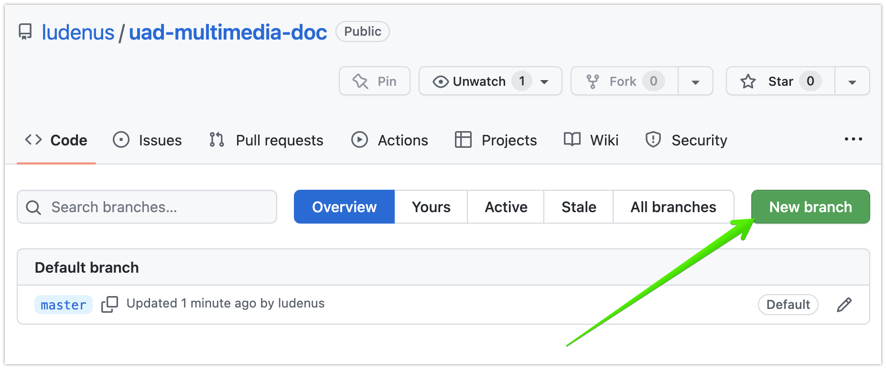

# Використання систем контролю версій для колективної роботи над мультимедійною документацією.
 
УКРАЇНСЬКА АКАДЕМІЯ ДРУКАРСТВА.
 
Студент: **Андрєєв Андрій**.
 
Викладач: **Огірко Ігор Васильович**, професор, доктор фізико-математичних наук, завідувач кафедри інформаційних мультимедійних технологій.
 
## Вступ
 
Сучасні програмні і апаратні продукти складні і потребують документації. Сучасна документація - це завжди мультимедійний продукт, оскільки містить текст, таблиці, зображення, відео та найважливіше - гіперпосилання на інші документи і продукти. І розробка самих продуктів, і розробка документації - це ітеративний процес, що потребує участі багатьох людей.
 
Ефективна робота багатьох людей вимагає технічних рішень для перегляду, порівняння, редагування, узгодження змін в документах. Одне з таких технічних рішень - системи контролю версій.
 
Системи контролю версій (англ. [version control](https://en.wikipedia.org/wiki/Version_control)) дозволяють зберігання багатьох версій документації, а також надають засоби для роботи із змінами для багатьох користувачів. Нижче ми розглянемо рефлективний приклад використання сучасної системи контролю версій для роботи над документом. Тобто цей документ сам і є описаним прикладом.
 
## Історія виникнення і основне призначення
 
Історично, основне призначення систем контролю версій - це управління змінами вихідного коду програмних продуктів. Оскільки будь-яка мова програмування - це максимально формалізований запис алгоритму, придатний до виконання машиною, то текст такого коду програми є максимально "чутливим" до будь-яких змін. І якщо синтаксичні помилки типово призводять до помилок компіляції, то семантичні помилки - коректно компілюються в виконавчий код, але працюють неправильно. Наприклад зайвий знак **=** в [операторі присвоювання](https://uk.wikipedia.org/wiki/Оператор_присвоювання#Символ_присвоєння) драматично змінює зміст операції і перетворює її в перевірку на рівність. Коли обидві операції можливі в певному контексті - ніякої помилки с точки зору компілятора немає, але насправді вона є і тільки людина може її виправити. Через це підтримка належної якості коду програм потребує регулярної процедури [перегляду коду](https://uk.wikipedia.org/wiki/Перегляд_коду) (англ. code review). Зазвичай одиничні помилки в текстах документів не настільки радикально змінюють зміст, як в коді програм, але існують випадки, коли ретельний перегляд тексту також критично необхідний. Наприклад - юридичні документи, де зайва кома може змінити тлумачення закону і вирок суду.
 
Великий об'єм вихідного коду програм робить неможливим перегляд повного тексту кожен раз при зміні його частини. Тому доцільним є перегляд і перевірка лише змін до попередньої версії коду. Саме для цього і призначені системи контролю версій. Такі системі розглядають останню версію коду як індексований набір змін, послідовно застосованих до самої першої, початкової його версії. Таким чином на кожному етапі є попередня і наступна версії і є різниці між ними, яку можна розглянути окремо і перевірити людиною.
 
Із кінця 70х років минулого століття було розроблено досить багато різних систем контролю версій. Серед поширених можна згадати CVS, Subversion, Mercurial, Perforce, ClearCase тощо. Всі вони мали певні особливості і використовували свої власні термінології для визначення різних операцій. Але останнім часом найбільш широко вживаним є [Git](https://uk.wikipedia.org/wiki/Git)[^1]. На основі Git існує декілька онлайн сервісів, які доповнюють основні функції Git зручним графічним інтерфейсом і іншими додатковими функціями. Варті уваги SourceForge, Bitbucket, GitLab і звичайно [GitHub](https://github.com). Нижче ми будемо використовувати терміни, які звичні Git/GitHub спільноті.
 
## Терміни[^2]
 
**Діфф** (diff) - процесс, який виконує порівняння версій, а також результат такого порівняння, який може бути збережений у вигляді окремого файла. [Наприклад](https://github.com/ludenus/uad-multimedia-doc/commit/d9d7c140348f331bcff9ec4ed924656378a70ea6).
 

 
**Патч** (patch) - процесс, який застосовує (накладає) попередньо створений діфф на іншу версію, а також сам файл із змінами, призначений для цього. Коли процес накладання патча виконано - утворюється новий комміт.
 
**Комміт** (commit) - окремо проіндексована сукупність змін, фактично окрема версія, яку може розрізняти система контролю версій і на яку можливо посилатись. Список коммітів для цього документу доступний [тут](https://github.com/ludenus/uad-multimedia-doc/commits/master) і виглядає так:
 

 
**Тег** (tag) - будь-який комміт, якому для зручності дали додаткове унікальне ім'я. Як правило використовують для більш наочного позначення важливих змін. Створити новий тег можна  [тут](https://github.com/ludenus/uad-multimedia-doc/releases)

 
**Бранч** (branch) - гілка, один із можливих варіантів документа, який для зручності також має унікальне ім'я і відрізняється від основного варіанту (master) іншою послідовністю коммітів. Типово кожний користувач використовує свій окремий бранч для внесення змін. Коли всі необхідні зміни додані - бранчі можна порівнювати і об'єднувати. Переключатись на певний бранч або тег можна можна [тут](https://github.com/ludenus/uad-multimedia-doc/commits/master)
 

 

 
Створити новий бранч можна [тут](https://github.com/ludenus/uad-multimedia-doc/branches)
 

 
 
**Мерж** (merge) - процес об'єднання бранчів. Може здійснюватись одним користувачем, "безконтрольно", а може - декількома людьми із створенням пулл-реквесту і проходженням процедури перегляду коду (code review).
 
**Пулл-реквест** (pull-request) - запит на внесення змін. Так вийшло, що цей рядок відредагували і забули злити зміни в основну гілку.
 

 
Співавтори можуть переглядати зміни, запропоновані пулл-реквестами і приймати чи відхиляти їх.
 

 
**Репозиторій** (repository) - вся сукупність даних проекту, всіх його версій, тегів, бранчів, а також вся історія їх змін - тобто все, що було проіндексоваано системою контролю версій. Репозиторій, в якому зберігається цей документ, доступний за таким гіперпосиланням: https://github.com/ludenus/uad-multimedia-doc
 
## Корисні функції
На прикладі цього документа ми бачимо, які корисні можливості Git/GitHub дає користувачам:
* Створення і публікацію мультимедійних документів, які містять: текст із форматуванням, зображення, гіперпосилання на інші документи.
* Редагування тексту онлайн безпосередньо в браузері і оффлайн в окремому текстовому рредакторі.
* Можливість спільної роботи над документами багатьом співавторам.
* Зберігання історії версій і змін для кожного документа.
* Дані про співавтора, що змінив будь-який рядок в документі, дату та час, коли відбулась зміна (режим blame). Надзвичайно корисна функція, коли після тривалого проміжку часу потрібно задати комусь питання - а чому тут написано саме так!
 

 

 
## Формати
GitHub підтримує такі мови розмітки для написання документів як Markdown і AsciiDoc. Перший - простіший і більш розповсюджений, другий надає додаткові можливості форматування тексту. Обидва варіанти розмітки можуть відображатись в зрозумілій людині формі навіть при відсутності графічного середовища, коли доступний лише текстовий термінал.
 
### Markdown
Прикладом Markdown синтаксису може бут цей документ. Правила розмітки в подробицях описані [тут](https://docs.github.com/en/get-started/writing-on-github/getting-started-with-writing-and-formatting-on-github/basic-writing-and-formatting-syntax).
 
### AsciiDoc
Приклад AsciiDoc доступний в нашому проекті в файлі [asciidoc.adoc](asciidoc.adoc). Правила AsciiDoc розмітки описані ца [цим](https://docs.asciidoctor.org/asciidoc/latest/) посиланням.
 
## Інтерфейси
Користувачі можуть редагувати текст безпосередньо в браузері або використовувати Інтегральні середовиища розробки (IDE) наприклад Jetbrains IDEA.
 
### Браузер
Редагування в браузері.
 

 
Результат після збереження змін.
 

 
### IDE
Робота в IDE може виконуватись оффлайн - тобто без доступу до Інтернету. При цьому під час редагування одночасно доступний і режим перегляду. Зміни зберігаються на локальну файлову систему, а коли зв'язок стає доступний - можуть бути синхронізовані звичайними засобами роботи з Git.
 

 
### Альтернативні формати і способи публікації
В цьому документі ми розглянули лише базові можливості Git/GitHub для створення документації. Можливих варіантів інструментів, форматів і способів публікації існує набагато більше. Варті уваги і можуть бути предметом окремих досліджень наприклад такі:
* [GitHub Pages](https://pages.github.com/) система публікації з розширеними можливостями.
* [RSTDoc](https://docutils.sourceforge.io/rst.html) - альтернатива Markdown i AsciiDoc розміткам.
* [Hugo](https://gohugo.io/) генератор статичніх сайтів на основі Markdown розмітки.
* [Jekyll](https://jekyllrb.com/) генератор статичнх сайтів на основі [Liquid](https://shopify.github.io/liquid/) шаблонів.
 
[^1]: Автор Git, [Лінус Торвальдс](https://uk.wikipedia.org/wiki/Лінус_Торвальдс), більш знаменитий тим, що створив ядро операційної системи [Linux](https://uk.wikipedia.org/wiki/Linux).
[^2]: Ми навмисно використовуємо транскрибцію англомовних термінів, не намагаючись робити "літературній" переклад для них. Тому що всім досвідченим україномовним користувачам Git завжди зрозуміло, словосполучення "помержи цей бранч в мастер" але не всі зрозуміють "поглинь цю гілку в господаря".
 
 

